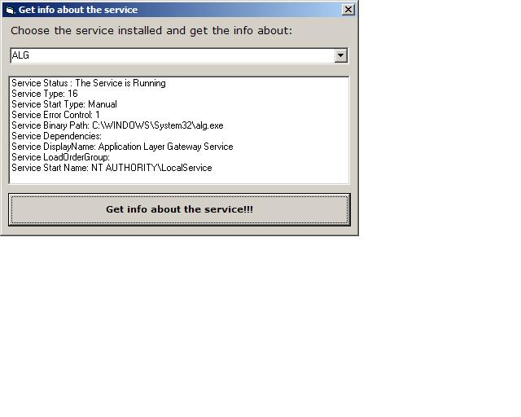



## Service info

### Description

This utility enumerates all system services and get info from them .
 
### More Info
 

             |
---                |---
**Submitted On**   |2005-09-15 23:33:40
**By**             |[Tomas Misura](https://github.com/Planet-Source-Code/PSCIndex/blob/master/ByAuthor/tomas-misura.md)
**Level**          |Advanced
**User Rating**    |4.5 (18 globes from 4 users)
**Compatibility**  |VB 6\.0
**Category**       |[Windows System Services](https://github.com/Planet-Source-Code/PSCIndex/blob/master/ByCategory/windows-system-services__1-35.md)
**World**          |[Visual Basic](https://github.com/Planet-Source-Code/PSCIndex/blob/master/ByWorld/visual-basic.md)
**Archive File**   |[Service\_in1933069162005\.zip](https://github.com/Planet-Source-Code/tomas-misura-service-info__1-62578/archive/master.zip)

### API Declarations

a lot of, see module

